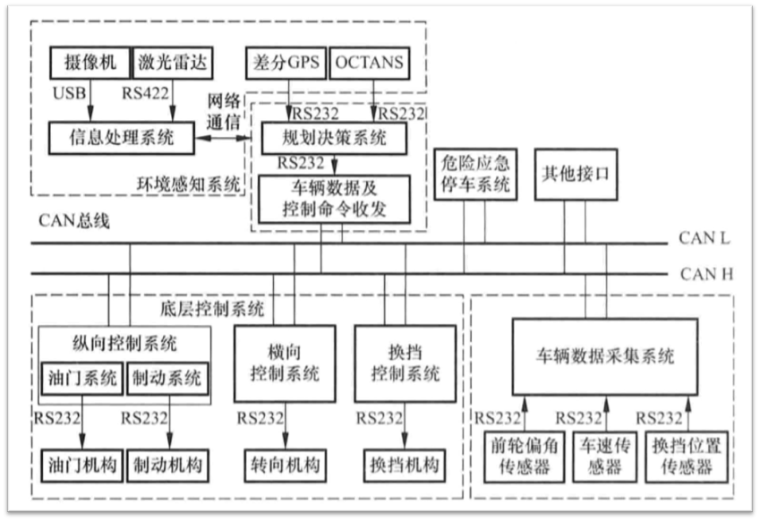
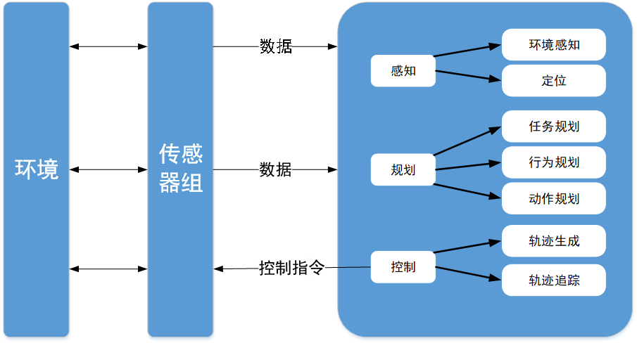
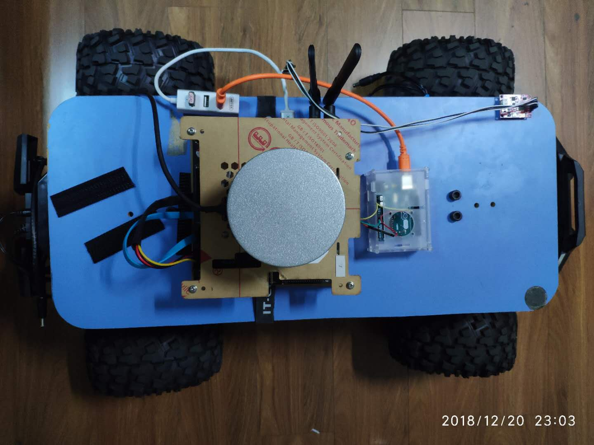
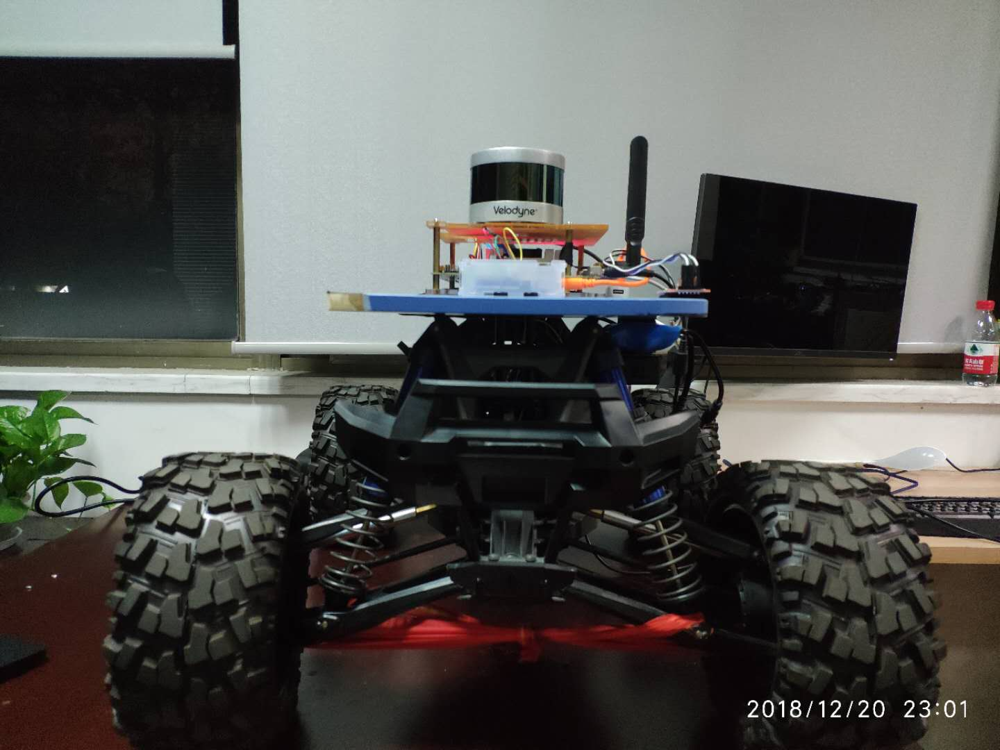
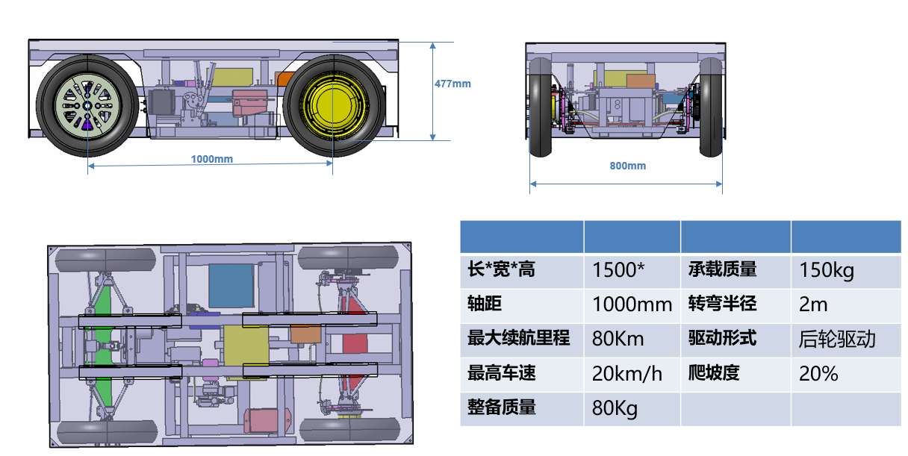
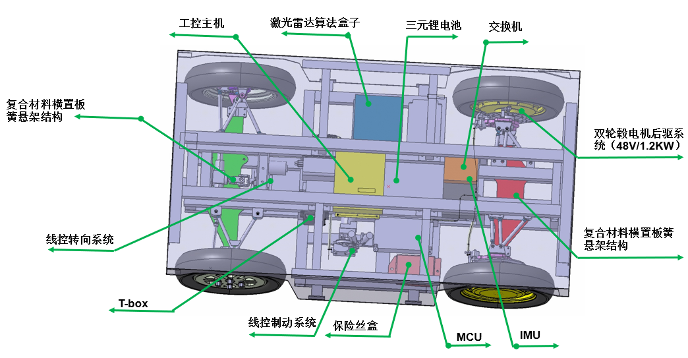

# 4WD_Smart_Car

## 系统框架
### 无人驾驶整体框架

### 感知框架

## Demo 硬件平台：

#### 计算平台
- Jetson TX2
- arduino-uno
#### 车载平台
- RC-car
#### 传感器
- velodyne-16
- Razor-9dof-imu

## 线控底盘实验

#### 实验平台
#### 底盘尺寸

#### 底盘结构
